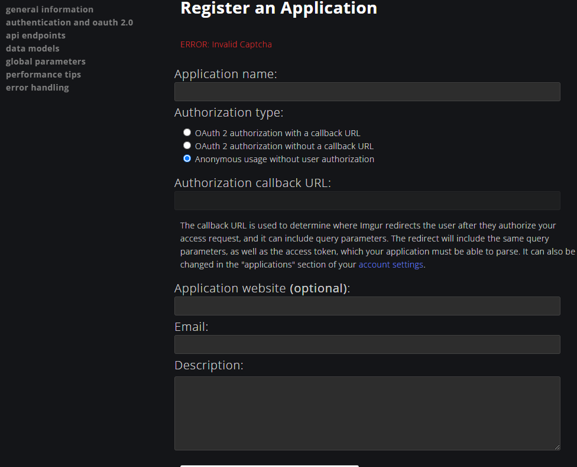

# imgur
基于 **imgur** 的web图片托管页面，即开即用

## 配置 `ClientID`
在 `https://api.imgur.com/oauth2/addclient` 注册 `clientId`




```
const res = await fetch('https://api.imgur.com/3/upload', {
    method: 'POST',
    headers: { Authorization: `Client-ID ${clientId}` },
    body: formData,
})
```
